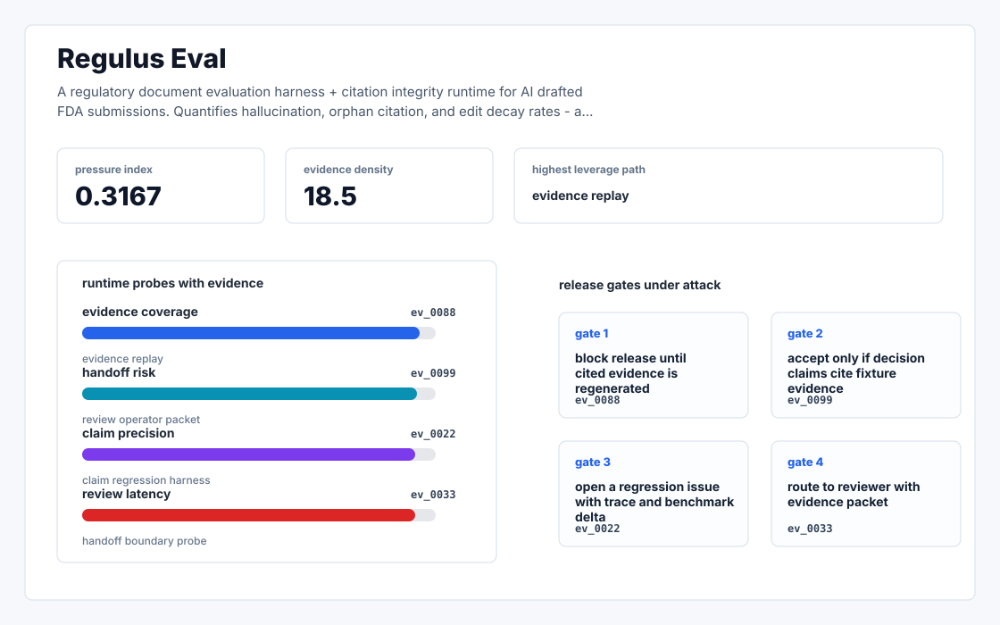
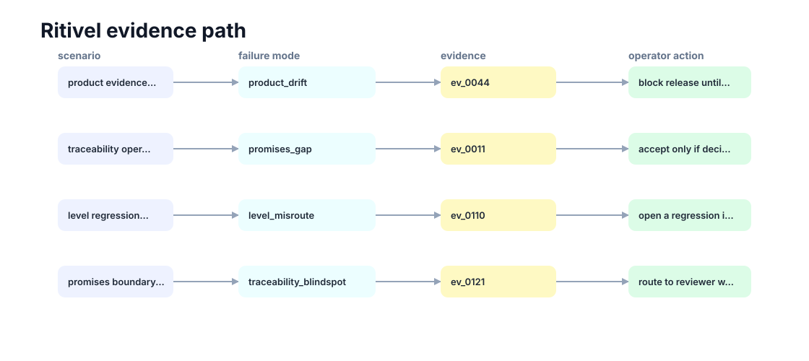

# Regulus Eval

A regulatory document evaluation harness + citation integrity runtime for AI drafted FDA submissions.



## Why it exists

Their product page promises "word level traceability linking every statement to source documents." Anyone who has shipped a RAG system into a regulated environment knows the awkward truth: traceability at draft time is easy; it's preserved under edit traceability that breaks the contract.

Most internal demos stop at a pretty chart. This repository is built around the harder part: a repeatable path from fixture, to failure, to evidence, to the operator action a serious team would actually trust.

## What is inside

- A deterministic replay harness tuned around product, promises, and level.
- Company-specific strategy code in `src/regulus_eval/strategy.py`, not just README-level customization.
- Citation-locked reports where every decision claim has to point back to a generated evidence ID.
- Two visual artifacts generated from the latest run: `outputs/project_working.svg` and `outputs/evidence_map.svg`.
- A portable demo pack with JSON, CSV, Markdown, HTML, SVG, and benchmark artifacts.



## Signals it measures

- `product coverage`
- `promises risk`
- `level precision`
- `traceability latency`

## Failure modes it plants

- product drift
- promises gap
- level misroute
- traceability blindspot

## Run it locally

```bash
uv sync
uv run regulus-eval all
uv run pytest -q
uv run ruff check .
```

## Outputs worth opening

- `outputs/dashboard.html`
- `outputs/project_working.svg`
- `outputs/evidence_map.svg`
- `outputs/operator_brief.md`
- `outputs/decision_report.md`
- `outputs/strategy_model.json`
- `outputs/demo_pack.zip`

## Sources

- https://www.ycombinator.com/launches/PJn-ritivel-ai-native-platform-for-regulatory-document-submission
- https://www.ritivel.com/blog
- https://fondo.com/blog/ritivel-launches
- https://www.linkedin.com/in/tankalapavankalyan/
- https://www.linkedin.com/in/nirmitarora/
- https://scholar.google.com/citations?user=hogvPo8AAAAJ&hl=en
- https://www.linkedin.com/in/gunin-gupta-3a5775194/
- https://www.falconebiz.com/company/RITIVEL-AI-PRIVATE-LIMITED-U62011KA2025PTC212044
- https://intuitionlabs.ai/articles/ai-medical-writing-ctd-module-2-summaries
- https://intuitionlabs.ai/articles/ectd-submission-ind-nda-guide

## Boundary

Everything runs locally against synthetic fixtures. There are no credentials, no customer records, no outreach files, and no hosted API dependency.
